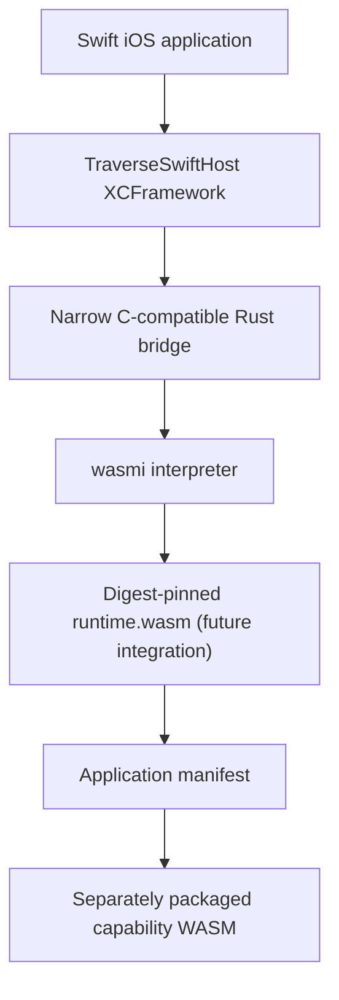
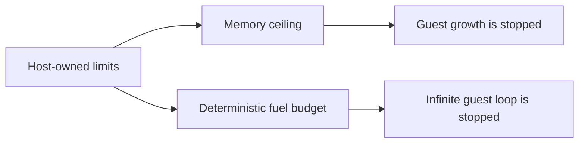
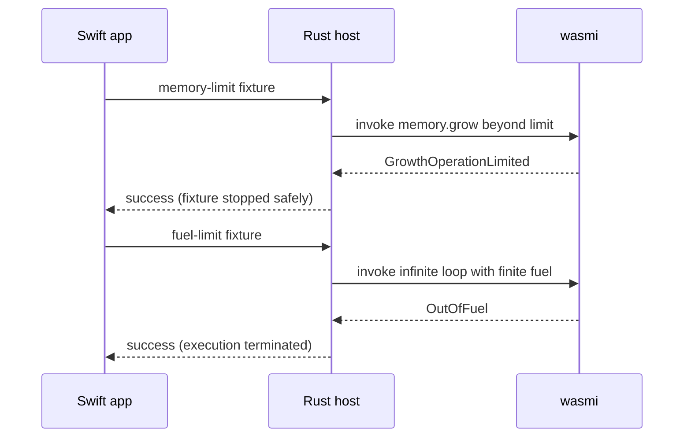

# Native iOS Runtime Foundation: Hands-On Article Source

## Audience

Developers building portable WebAssembly capability systems that need a native
iOS host without relying on a JIT runtime.

## What this article demonstrates

Traverse validated that a Swift application can call a Rust static library
containing the `wasmi` interpreter, enforce host-owned WebAssembly memory and
fuel limits, and run successfully on a physical Apple device.

This is a foundation for a production iOS runtime path. It is not an
announcement that the full Traverse runtime or SDK has shipped on iOS.

## Architecture



The feasibility proof covers the Swift host, Rust bridge, and `wasmi`
interpreter layers. Runtime and capability integration are later work.

## Why this approach



The host, not an untrusted module, controls resource limits. This is essential
when capabilities are independently packaged and may run on multiple platforms.

## What was verified

| Proof | Result |
| --- | --- |
| Rust static-library build | Built for iPhone, Apple Silicon iOS simulator, and Apple Silicon macOS. |
| Swift interop | Swift imported the XCFramework and called the Rust bridge on macOS. |
| Memory control | Growth past a configured 64 KiB host limit stopped with `GrowthOperationLimited`. |
| Execution control | A non-terminating module stopped with `OutOfFuel`. |
| Physical iOS run | The proof app launched with no Xcode errors, displayed success, and remained responsive. |

## Hands-on: build the XCFramework

Use the #769 branch/worktree:

```bash
cd /private/tmp/traverse-issue-769
bash scripts/build_swift_host_xcframework.sh
```

This creates:

```text
target/apple/TraverseSwiftHost.xcframework
```

The framework contains slices for an iPhone device, Apple Silicon simulator,
and Apple Silicon macOS.

## Hands-on: run the macOS smoke test

```bash
bash scripts/swift_host_macos_smoke.sh
```

Expected output:

```text
Traverse Swift host ABI 1 is available
```

This compiles a small Swift program that imports the XCFramework and calls the
Rust static library.

## Hands-on: run the resource-control tests

```bash
cargo test -p traverse-swift-host
```

Expected result: three passing tests. They verify the host API version,
memory-growth rejection, and fuel exhaustion.

## Hands-on: test on an iPhone or iPad

1. Create a new SwiftUI iOS App in Xcode named `TraverseSwiftHostProof`.
2. Set your development team and a unique bundle identifier.
3. Drag `target/apple/TraverseSwiftHost.xcframework` into the project.
4. Add it to **Frameworks, Libraries, and Embedded Content** as **Do Not
   Embed** because it is static.
5. Replace the application entry point with:

```swift
import SwiftUI
import TraverseSwiftHost

@main
struct TraverseSwiftHostProofApp: App {
    init() {
        precondition(traverse_swift_host_abi_version() == 1)
        precondition(traverse_swift_host_memory_limit_fixture() == 0)
        precondition(traverse_swift_host_fuel_limit_fixture() == 0)
    }

    var body: some Scene {
        WindowGroup { Text("Traverse Swift host proof passed") }
    }
}
```

6. Connect and unlock the device, trust the Mac if prompted, select it in
   Xcode, and press Run.
7. Record the device model, iOS version, Xcode version, commit SHA, visible
   success message, and responsiveness after the fixtures run.

## What the device test means



The proof shows that the app regains control after both hostile cases; it does
not rely on a watchdog that leaves guest code running.

## What remains

- Select `wasmi` through a successor ADR.
- Resolve the scoped C-ABI governance follow-up (#771).
- Implement the complete Swift embedder SDK (#647).
- Run the digest-pinned Traverse runtime and application manifests.
- Validate declared capability profiles and cross-host conformance.

## References

- [Traverse wasmi feasibility spike #769](https://github.com/traverse-framework/traverse/issues/769)
- [Scoped C-ABI governance follow-up #771](https://github.com/traverse-framework/traverse/issues/771)
- [`wasmi` documentation](https://docs.rs/wasmi/latest/wasmi/)
- [`StoreLimitsBuilder` API](https://docs.rs/wasmi/latest/wasmi/struct.StoreLimitsBuilder.html)
- [Full physical-device guide](swift-host-device-test.md)
- [Narrative blog brief](blog-native-ios-runtime-foundation-brief.md)
